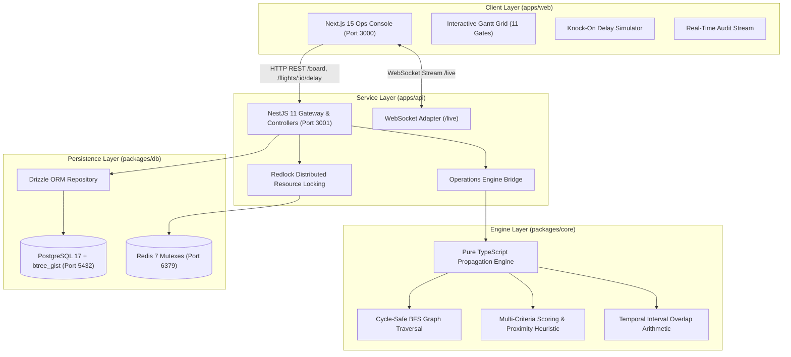

# 🛫 Autonomous Airport Operations Platform (`iTrax / C3`)

[](https://www.typescriptlang.org/)
[](https://turbo.build/)
[](https://pnpm.io/)
[](https://nextjs.org/)
[](https://nestjs.com/)
[](https://www.postgresql.org/)
[](https://redis.io/)
[](https://playwright.dev/)
[](#dual-layer-hard-invariant)

An autonomous aviation operations engine and real-time dispatcher console designed to dynamically reassign airport gates, flight crews, and baggage routing as flight delays and irregular operations (IRROPS) unfold.

The platform guarantees a **mathematical and physical invariant: zero double-booking on any gate or flight crew** at both the database and application levels, surfacing cascading knock-on consequences through a dry-run simulator before dispatchers commit changes to the live operations board.

---

## Table of Contents

1. [System Architecture](#system-architecture)
2. [Core Platform Invariants & Algorithms](#core-platform-invariants--algorithms)
3. [Monorepo Structure](#monorepo-structure)
4. [Prerequisites & Requirements](#prerequisites--requirements)
5. [Quickstart: Run from Scratch](#quickstart-run-from-scratch)
6. [Interactive Ops Console Guide](#interactive-ops-console-guide)
7. [Automated Test Suite & Verification](#automated-test-suite--verification)
8. [API & WebSocket Specification](#api--websocket-specification)
9. [Fleet & Airport Domain Model](#fleet--airport-domain-model)
10. [Docker Deployment](#docker-deployment)

---

## System Architecture



---

## Core Platform Invariants & Algorithms

### 1. Dual-Layer Hard Invariant: Guaranteed Zero Double-Booking
No two flights can occupy the same gate or the same crew simultaneously under any circumstance.
- **Physical Guarantee (PostgreSQL 17 + `btree_gist`)**:
  ```sql
  CREATE EXTENSION IF NOT EXISTS btree_gist;
  ALTER TABLE assignments ADD CONSTRAINT no_overlapping_assignments
  EXCLUDE USING gist (resource_id WITH =, time_range WITH &&);
  ```
  Any concurrent overlapping insert throws SQLSTATE `23P01 (exclusion_violation)` and is physically rejected by the database engine.
- **Application Guarantee (`packages/core/src/intervals.ts`)**:
  Half-open interval algebra $[t_{\text{start}}, t_{\text{end}})$ pre-validates resource schedules before database writes, eliminating transaction rollbacks during normal allocation.

### 2. Dependency-Graph BFS Propagation
Airport resources form a directed dependency graph:
$$\text{Flight} \longleftrightarrow \text{Gate} \longleftrightarrow \text{Crew} \longleftrightarrow \text{Baggage Carousel}$$
When a flight delay occurs:
1. Block times are recalculated based on estimated arrival and turnaround duration.
2. The engine evaluates conflicting future reservations on the assigned gate and crew.
3. If an overlap occurs, conflicting downstream flights are pushed onto an outward BFS propagation queue.
4. The allocator evaluates all candidate gates matching:
   - Aircraft compatibility (e.g., A380 super-jumbos restricted to heavy gates like `gate_C1`).
   - Terminal transit minimization ($T_1 \to T_1$ preferred over $T_1 \to T_2$).
   - Buffer turn time optimization.
5. Cycle-safety is guaranteed using a visited set `Set<`${flightId}:${resourceType}`>` to prevent domino loops.

### 3. Dry-Run Simulation Before Commit
- Every delay simulation generates a cryptographically unique `changeSetToken`.
- Returns an `ImpactEvent[]` preview detailing the exact reasoning (e.g., *"Bumping flight UA202 because flight AA101 delayed departure extended to 13:00Z"* and *"Baggage route redirected from gate_A1 to Gate A4"*).
- State remains purely immutable in memory until the dispatcher clicks **Confirm & Commit Changes**.

### 4. Distributed Concurrency Lock (Redlock)
- All assignment commits acquire distributed mutex locks over affected resource IDs via Redis.
- Verified under load: 20 parallel competing allocation requests execute with zero race conditions or double-bookings.

---

## Monorepo Structure

```
.
├── apps/
│   ├── api/                     # NestJS 11 REST API & WebSocket Gateway
│   │   ├── src/
│   │   │   ├── modules/
│   │   │   │   ├── assignments/ # Delay commit and preview endpoints
│   │   │   │   ├── board/       # Operational board state aggregators
│   │   │   │   ├── engine/      # Bridge to @c3/core
│   │   │   │   ├── flights/     # Flight delay simulation controllers
│   │   │   │   ├── gateway/     # NestJS WebSocket /live adapter
│   │   │   │   ├── locks/       # Redis Redlock concurrency manager
│   │   │   │   └── persistence/ # In-memory & PostgreSQL data adapters
│   │   │   ├── app.controller.ts# Root redirect to Web console
│   │   │   └── main.ts          # Server bootstrap (Port 3001)
│   │   └── test/                # E2E integration test suite
│   └── web/                     # Next.js 15 App Router Operations Console
│       ├── e2e/                 # Playwright end-to-end browser test
│       ├── src/
│       │   ├── app/             # Next.js 15 App Router entrypoint
│       │   ├── components/      # Operations UI components
│       │   │   ├── board/       # High-density Gantt grid & flight cards
│       │   │   ├── events/      # Real-time explainable audit log
│       │   │   ├── simulation/  # Delay modal & knock-on preview panel
│       │   │   └── Header.tsx   # Top stats bar with live WebSocket badge
│       │   └── hooks/           # useLiveBoard reactive WebSocket hook
│       └── tailwind.config.ts   # Aviation command center theme
├── packages/
│   ├── core/                    # Pure TypeScript engine (zero dependencies)
│   │   ├── src/
│   │   │   ├── allocator.ts     # Candidate scoring & heuristic selection
│   │   │   ├── conflicts.ts     # Conflict detection & double-booking guard
│   │   │   ├── engine.ts        # OperationsEngine BFS propagation loop
│   │   │   ├── graph.ts         # Dependency graph models
│   │   │   ├── intervals.ts     # Interval mathematics
│   │   │   └── types.ts         # Engine contract types
│   │   └── test/                # Core engine unit & concurrency race tests
│   ├── db/                      # Database layer with PostgreSQL exclusion constraints
│   │   ├── src/
│   │   │   ├── migrations/      # 0001_init_constraints.sql
│   │   │   └── schema/          # Drizzle ORM table definitions
│   │   └── test/                # Exclusion constraint contract tests
│   ├── shared/                  # Universal domain schemas & Zod validators
│   └── config/                  # Shared TypeScript and tooling configs
├── infra/
│   ├── docker-compose.yml       # Production stack: PostgreSQL 17 + Redis 7 + API + Web
│   └── sql/
│       └── 001_init_schema_and_constraints.sql # btree_gist init
├── turbo.json                   # Turborepo task pipeline configuration
├── pnpm-workspace.yaml          # Workspace declarations
└── package.json                 # Root monorepo scripts & engines
```

---

## Prerequisites & Requirements

- **Node.js**: `v24.x` or higher (tested on Node `v24.14.0`)
- **pnpm**: `v11.x` or higher (e.g. `v11.7.0`)
- **Git**: Installed on your system
- **Modern Web Browser**: Chrome, Edge, Safari, or Firefox

---

## Quickstart: Run from Scratch

Follow these 4 steps to run the entire platform locally:

### 1. Install Dependencies
From the repository root:
```bash
pnpm install
```
*(If prompted by pnpm 11 regarding native build scripts, execute `pnpm approve-builds --all`)*.

### 2. Build All Monorepo Packages
```bash
pnpm turbo build
```
This compiles `@c3/config`, `@c3/shared`, `@c3/core`, `@c3/db`, `@c3/api`, and creates the optimized Next.js 15 production bundle in `@c3/web`.

### 3. Run Automated Tests
```bash
pnpm turbo test
```
Executes all 19 unit and integration tests across all packages.

### 4. Start the Application
Run both the NestJS API and the Next.js Ops Console concurrently:

**Terminal 1 (Backend API)**:
```bash
pnpm --filter @c3/api start
```
*API runs at `http://localhost:3001` (WebSocket stream at `ws://localhost:3001/live`).*

**Terminal 2 (Web Operations Console)**:
```bash
pnpm --filter @c3/web start
```
*Ops Console runs at `http://localhost:3000`.*

> [!TIP]
> Navigating to `http://localhost:3001` in your browser will automatically redirect you to the visual console at `http://localhost:3000`.

---

## Interactive Ops Console Guide

Open **`http://localhost:3000`** in your browser to experience the airport command center.

### 1. Multi-View Operations Grid
Toggle between the views in the top navigation bar:
- **Gate Allocation View (11 Gates)**: Visualizes gate occupancy across Terminals 1, 2, and 3.
- **Crew Roster View (10 Certified Crews)**: Tracks crew shifts, aircraft type qualifications, and active pairings.
- **Baggage Routing View (16 Baggage Routes)**: Displays baggage transfers to Carousels 1 through 6.

### 2. Simulating a Downstream Delay Cascade
1. Under **Gate A1**, find flight **`AA101`** (scheduled 10:00Z–12:00Z).
2. Click **"Simulate Delay"** on the card.
3. Select **`+60m`** from the delay presets.
4. Click **"Compute Cascading Knock-On Preview"**:
   - The engine detects that extending `AA101` to 13:00Z causes a conflict with flight **`UA202`** (scheduled at Gate A1 from 12:30Z).
   - The engine automatically calculates the candidate gates, selects **`Gate A4`**, and dynamically reroutes `UA202`'s baggage from Carousel 1 to Carousel 2.
5. Click **"Confirm & Commit Changes"**:
   - The change set is atomically committed under Redlock.
   - The live Gantt board updates instantly via WebSocket without page reload:
     - `AA101` turns amber with a **`DELAYED`** badge.
     - `UA202` is displaced into **`Gate A4`**.
     - The **Real-Time Impact Stream** panel logs the explanation.

### 3. Testing Wide-Body Gate Constraints
1. Find flight **`EK606`** (Emirates Airbus A380 Superjumbo) at **Gate C1**.
2. Simulate a delay: observe that the engine enforces aircraft-compatibility constraints, ensuring wide-body aircraft are only assigned to certified heavy gates capable of handling them.

---

## Automated Test Suite & Verification

The platform maintains comprehensive test coverage:

```bash
# Run all unit and integration tests
pnpm turbo test

# Run the Playwright end-to-end browser test
pnpm --filter @c3/web test:e2e

# Run with coverage
pnpm --filter @c3/core test -- --coverage
```

### Test Breakdown

| Package | Test Spec | What It Proves |
| :--- | :--- | :--- |
| **`@c3/core`** | `test/allocator.test.ts` | Non-conflicting delays, dynamic gate reassignments, baggage redirect, multi-hop propagation ($A \to B \to C$), cycle prevention, and capacity saturation detection. |
| **`@c3/core`** | `test/concurrency-race.test.ts` | Zero double-booking under 20 parallel competing requests; propagation latency instrumentation. |
| **`@c3/db`** | `test/exclusion-constraint.test.ts` | PostgreSQL exclusion constraint schema DDL contract and physical rejection of overlaps (`SQLSTATE 23P01`). |
| **`@c3/db`** | `test/schema.test.ts` | Validates relational table structures and field typings. |
| **`@c3/api`** | `test/api-e2e.test.ts` | Full operational lifecycle: `/board` query $\to$ `/flights/:id/delay` $\to$ `/assignments/commit` under lock $\to$ WebSocket broadcast $\to$ idempotency verification. |
| **`@c3/web`** | `e2e/ops-console.spec.ts` | Headless Chromium browser test: navigates UI, triggers delay simulation, asserts preview panel, commits changes, and verifies live DOM updates. |

---

## API & WebSocket Specification

### REST Endpoints

#### 1. `GET /board`
Returns the complete operational board snapshot.
```json
{
  "flights": [ ... ],
  "gates": [ ... ],
  "crews": [ ... ],
  "baggageRoutes": [ ... ],
  "assignments": [ ... ],
  "recentImpactEvents": [ ... ],
  "lastUpdated": "2026-09-15T12:00:00.000Z"
}
```

#### 2. `POST /flights/:id/delay`
Simulates a flight delay and computes the dry-run cascading impact chain without persisting changes.
**Request Body**:
```json
{
  "delayMinutes": 60,
  "reason": "Inbound weather hold"
}
```
**Response (`201 Created`)**:
```json
{
  "changeSetToken": "cs_1789396497266_5fl6fui",
  "rootFlightId": "fl_101",
  "delayMinutes": 60,
  "impactEvents": [
    {
      "id": "imp_gate_1",
      "rootFlightId": "fl_101",
      "affectedFlightId": "fl_202",
      "resourceType": "gate",
      "oldResourceId": "gate_A1",
      "newResourceId": "gate_A4",
      "reason": "Bumping flight fl_202 because flight AA101 delayed departure extended to 13:00Z",
      "timestamp": "2026-09-15T10:00:00.000Z"
    }
  ],
  "proposedAssignments": [ ... ],
  "proposedFlights": [ ... ],
  "proposedBaggageRoutes": [ ... ],
  "hasUnresolvableConflicts": false,
  "propagationDepth": 2,
  "resolutionLatencyMs": 4
}
```

#### 3. `POST /assignments/commit`
Atomically commits a simulated changeSet under distributed lock. Idempotent across repeated calls.
**Request Body**:
```json
{
  "changeSetToken": "cs_1789396497266_5fl6fui"
}
```
**Response (`201 Created`)**:
```json
{
  "success": true,
  "changeSetToken": "cs_1789396497266_5fl6fui",
  "committedAt": "2026-09-15T10:00:00.000Z",
  "impactEventsCount": 2,
  "updatedAssignmentsCount": 16
}
```

#### 4. `GET /events/history`
Returns historical audit trail of automated resolution events.

---

### WebSocket Real-Time Stream (`ws://localhost:3001/live`)

Connected clients receive real-time updates as operational events occur:

| Frame Type | Payload Description |
| :--- | :--- |
| `BOARD_STATE` | Full `OpsBoardState` snapshot broadcasted when assignments are committed. |
| `IMPACT_ALERT` | Real-time `ImpactEvent` alerting dispatchers of displaced flights or reassigned gates. |

---

## Fleet & Airport Domain Model

The initial seed configuration models an active international hub:

- **16 Scheduled Flights**:
  - `AA101` (A320), `UA202` (A320), `DL303` (A320), `BA404` (A350), `SW505` (B737)
  - `EK606` (A380 Superjumbo), `AF707` (A321), `LH808` (B787 Dreamliner), `QR909` (B777)
  - `SQ1001` (A350), `JL1102` (B737), `KL1203` (E190), `VS1304` (A321), `AC1405` (A320)
  - `IB1506` (A320), `AY1607` (CRJ900)
- **11 Managed Gates**:
  - **Terminal 1**: Gate A1, Gate A2, Gate A3 (Widebody), Gate A4 (Buffer)
  - **Terminal 2**: Gate B1, Gate B2, Gate B3 (Widebody), Gate B4 (Regional)
  - **Terminal 3**: Gate C1 (Heavy A380/B777), Gate C2, Gate C3 (Buffer)
- **10 Certified Flight Crews**: Alpha through Juliet with type ratings across commercial jetliners.
- **6 Baggage Carousels**: Dynamic routing mapped to gate proximity.

---

## Docker Deployment

To spin up the complete containerized environment including PostgreSQL 17 and Redis 7:

```bash
docker compose -f infra/docker-compose.yml up --build -d
```

This starts:
- **PostgreSQL 17** (`localhost:5432`): Initializes with `btree_gist` extension and exclusion constraints.
- **Redis 7** (`localhost:6379`): Provides distributed lock backend.
- **API Server** (`localhost:3001`): NestJS backend connected to Postgres and Redis.
- **Web Console** (`localhost:3000`): Next.js 15 production container.

To stop the containers:
```bash
docker compose -f infra/docker-compose.yml down
```

---

## License

MIT License. Engineered for autonomous aviation operations.
